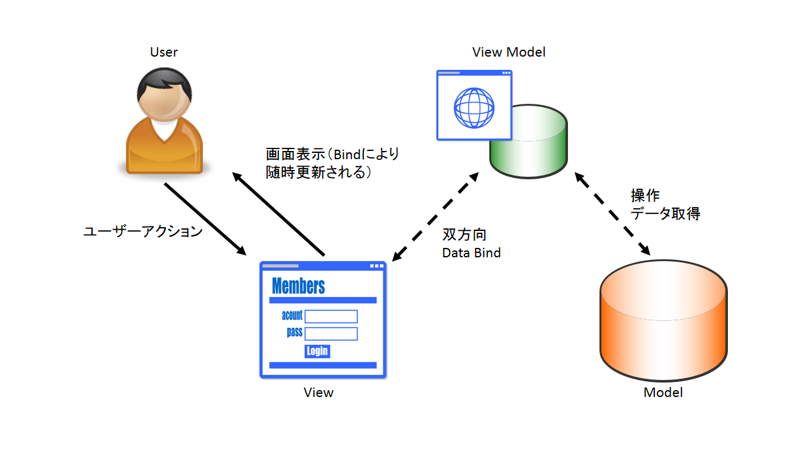
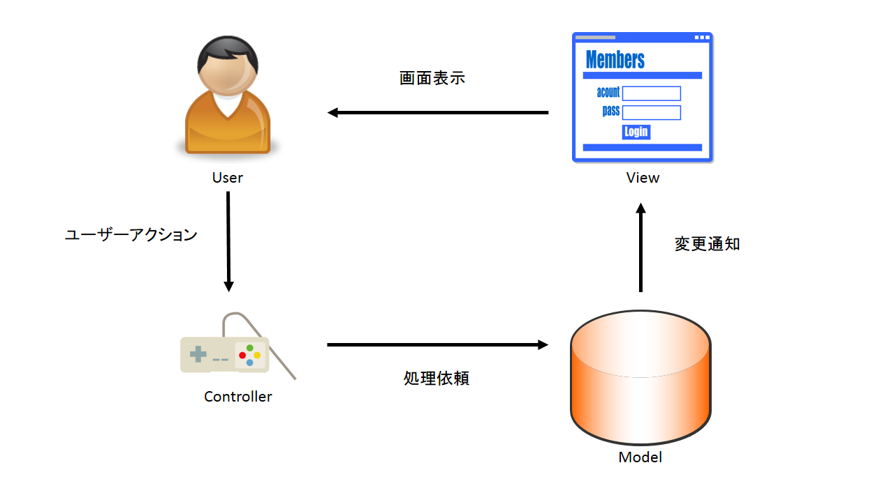
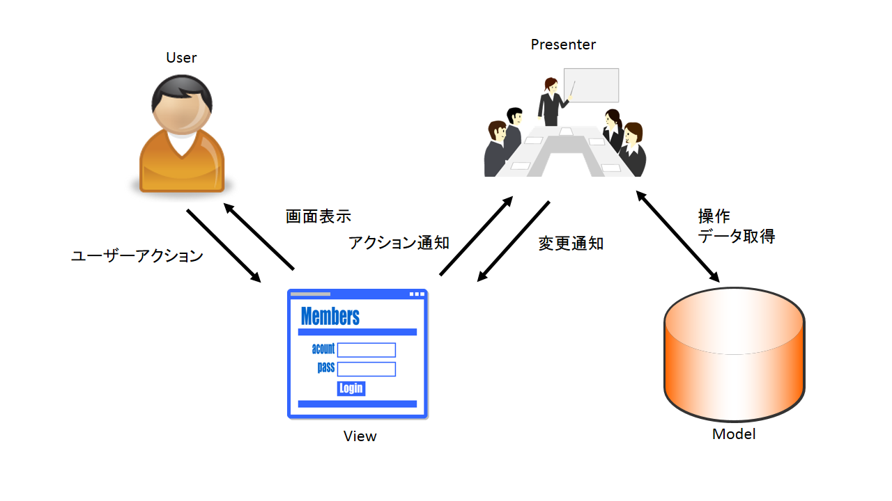

## MVVM
## WPF

---

## 目次
* 背景
* MVVMとは
* MVVMとMV○との違いは？
* WPF
* WPFでMVVM

---

## 背景

MVVMってよく聞くし、社内の勉強会もあるから参加してみたけど、なんとなくわかっている気になっているけど、でも良く分かんない。ちょっと勉強してみたことをまとめる。

---

## MVVMって何の略

M? V? V? M?

---

**M : Model(モデル)**

アプリケーションで扱うデータ、それに伴う機能（ビジネスロジック）

**V : View(ビュー)**

ユーザーへのデータの出力、ユーザーからのデータの入力

**VM : ViewModel(ビューモデル)**

ビューに描画するための状態の保持と、ビューから受け取った入力を変換してモデルに伝達、ビューとの通信にはデータバインディングを利用する

--

### MVVM関連図

--

## そもそもなんで3つに分けているの？

--

### 多層アーキテクチャ

アプリケーションを複数の"層"に分け、それらを独立したモジュールとして開発・保守する。各層はインタフェースを定義しモジュール化されたソフトウェアであり、テクノロジーの進歩や要求の変化に合わせて各層を個別に置換できる。(By wiki)

---

## これまであったMVC、MVPとは何が違うの？

---

### MVC関連図

---

 * 関連が多い
 * ViewとModelが関連し、Modelに依存するため処理が大きくなりやすい

---

### MVP関連図

---

* MVCと比べて関連が少なく、機能分担しやすい
* ModelとViewの関連が疎

---

## MV○とMVVMを比べて

* MVCと比べて関連が少なく、機能分担しやすい
* MVPと比べてViewとViewModel(Presenter)の関連が疎

---

### 参考サイト
* MVVM
  * http://qiita.com/shinkuFencer/items/f2651073fb71416b6cd7
* WPF
  * http://takamints.hatenablog.jp/entry/why-using-commands-in-wpf-mvvm

---
