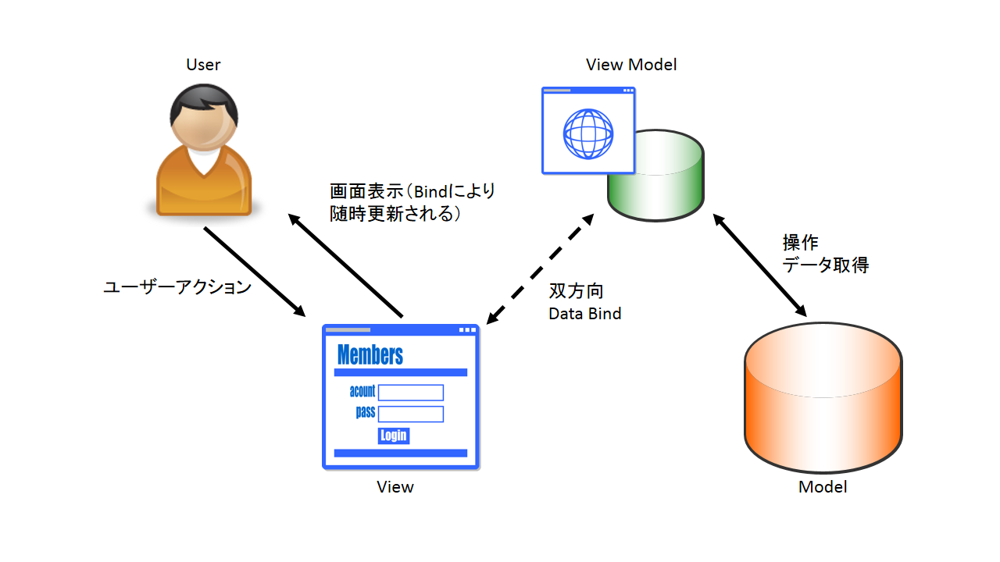

## MVVM
## WPF

---

## 目次
* 背景
* MVVMとは
* MVVMとMV○との違いは？
* WPF
* WPFとMVVM

---

## 背景

MVVMってよく聞くし、社内の勉強会もあるから参加してみたけど、なんとなくわかっている気になっているけど、でも良く分かんない。ちょっと勉強してみたことをまとめる。

---

## MVVMって何の略

M? V? V? M?

---

<span style="color: red; ">**M : Model(モデル)**</span>

アプリケーションで扱うデータ、それに伴う機能（ビジネスロジック）

<span style="color: blue; ">**V : View(ビュー)**</span>

ユーザーへのデータの出力、ユーザーからのデータの入力

<span style="color: green; ">**VM : ViewModel(ビューモデル)**</span>

ビューに描画するための状態の保持と、ビューから受け取った入力を変換してモデルに伝達、ビューとの通信にはデータバインディングを利用する

--

### MVVM関連図


--

## そもそもなんで3つに分けているの？

--

### 多層アーキテクチャ

アプリケーションを複数の"層"に分け、それらを独立したモジュールとして開発・保守する。各層はインタフェースを定義しモジュール化されたソフトウェアであり、テクノロジーの進歩や要求の変化に合わせて各層を個別に置換できる。(By wiki)

---

## これまであったMVC、MVPとは何が違うの？

---

### MVC関連図


---

 * 関連が多い
 * ViewとModelが関連し、Modelに依存するため処理が大きくなりやすい

---

### MVP関連図


---

* MVCと比べて関連が少なく、機能分担しやすい
* ModelとViewの関連が疎

---

### MV○とMVVMを比べて

* MVCと比べて関連が少なく、機能分担しやすい
* MVPと比べてViewとViewModel(Presenter)の関連が疎

---

## WPF

MVVMパターンでの開発するための仕組みが揃ったユーザーインターフェースサブシステム。

---

### MVVMパターンでの開発するための仕組み?

* デザインとロジックの分離
  * XAML + プログラミング言語コード(C#など)
* データバインディング
 
--

### その他、WPFの特徴

* グラフィックス
  * なんか綺麗で軽いらしい
* UI
  * 拡張機能が多く、カスタマイズしやすいらしい
* etc...
---

## XAMLとは?

Microsoft が開発した XML ベースのマークアップ言語

```
<Window x:Class="WpfApplication2.MainWindow"
        xmlns="http://schemas.microsoft.com/winfx/2006/xaml/presentation"
        xmlns:x="http://schemas.microsoft.com/winfx/2006/xaml"
        xmlns:d="http://schemas.microsoft.com/expression/blend/2008"
        xmlns:mc="http://schemas.openxmlformats.org/markup-compatibility/2006"
        xmlns:local="clr-namespace:WpfApplication2"
        mc:Ignorable="d"
        Title="Window with Button"  
        Width="250" Height="100">

    <!-- Add button to window -->
    <Button Name="button">Click Me!</Button>

</Window>
```

--


---

## データバインディングとは

データが変更されると、それとバインド(紐づけ)した要素に自動的に反映される。
ビューで表示する値を、コード上のプロパティとバインディング（片方の変更がもう片方にも反映される）することによって、デザイン(View)とロジック(コード)を分離することができる。

---

## データバインディングの利用シーン

* プロパティと画面項目のバインディング
* 画面項目間のバインディング
* コマンドインターフェースと画面での実行コマンドのバインディング

---

### プロパティと画面項目のバインディングとは

Vのコントロール（項目）の属性と、VMのプロパティの値をバインドする。INotifyPropertyChangedを利用することで簡単に実現でき、VMがVのコントロールの直接参照を持たないため疎な関係を実現できる。また、他の画面での流用もしやすい。

---

XAML
```
<TextBox Text="{Binding Input, Mode=TwoWay, UpdateSourceTrigger=PropertyChanged}" />
```

C#
```
private string input;
public string Input
{
    get { return input; }
    set 
    {
       if (Equals(field, value)) { return; }
       input = value;
       PropertyChanged(this, new PropertyChangedEventArgs(nameof(Input));
    }
}
```

--

Designer.cs
```
private System.Windows.Forms.TextBox textBox;
```

Form.cs
```
textBox.Text = model.Text;
```

---

### 画面項目間のバインディング

Vのコントロール（項目）の属性と、コントロールの属性をバインドする。コントロール間でバインドすることで、中間層(VMやP)を解さずに処理が可能。

---

※画面項目間のバインディングのサンプルコード

--

※Formで実現した場合のサンプルコード

---

---

### コマンドインターフェースと画面での実行コマンドのバインディングとは

ビューでのボタンクリックなどのコマンド実行の操作と、コマンドインターフェースをバインドする。ICommandを利用することで簡単に実現できる。コードビハインドではForm.csに大量の処理(On~)を記述する必要があり、肥大化しやすく、流用もしづらかった。コマンドをバインドすることで処理をクラス化でき、流用もしやすく、テストも行いやすい。

---

XAML
```
<Button Command="{Binding SampleCommand}"/>
```

ViewModel
```
public SampleCommand SampleCommand {get;} = new SampleCommand();
```

Command
```
public class SampleCommand : ICommand
{
 public event EventHandler CanExecuteChanged;
 public bool CanExecute(object parameter)
 {
  return true;
 }
 public void Execute(object parameter)
 {
  // 処理
 }
}
```

--

Designer.cs
```
Button button1 = new Button();
button1.Click += EventHandler(button1_Click);
Controls.Add(button1);
```

Form.cs
```
private void button1_Click(object sender, EventArgs e)
{
 // 処理
}
```

---

## WPFとMVVM

WPFはデザインとロジックの分離、データバインディングが実現されており、MVVMでの設計が適している（というか、MVVMでの設計を前提に作られている）。

---

## まとめ

* MVVMはビューとビューモデルが疎な関係になっているため、機能分担が明確
* WPFはMVVMで設計をしやすい仕組みになっている

---

## 注意

MVVMはMVC、MVPの上位互換ではない。MVVMはMVP等の前の設計パターンの弱い点を改善しているが、全ての面で勝っているわけではない。

---

### 参考サイト
* MVVM
  * http://qiita.com/shinkuFencer/items/f2651073fb71416b6cd7
* WPF
  * https://msdn.microsoft.com/ja-jp/library/mt149842.aspx
  * http://takamints.hatenablog.jp/entry/why-using-commands-in-wpf-mvvm

---
